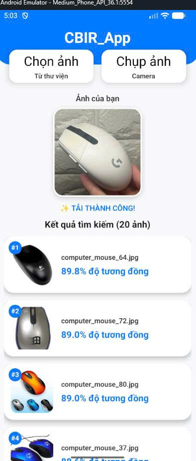

# 📱 CBIR_EDGE_AI
Content-Based Image Retrieval (CBIR) System Using Deep Learning Deployed on Mobile Devices

This project builds a content-based image retrieval (CBIR) system for technology products.

Instead of searching by text, the system allows users to find similar products using images.

A Deep Learning model is trained to extract feature vectors (embeddings) from images, then uses **Cosine Similarity** to find images with similar content.

The highlight of the project is deploying AI directly on mobile devices (**Edge AI**) with TensorFlow Lite, enabling offline operation without a server.

---

## 🚀 Key Features
- 🔍 Image search based on content similarity  
- 🧠 Feature extraction using Deep Learning (MobileNetV3)  
- 📱 AI runs directly on mobile devices  
- ⚡ Fast search with Cosine Similarity  
- 🌐 Works offline without Internet  
- 📦 Embedding dataset stored as `vectors.json`  

---

## 🧠 System Architecture
```
User Image (Camera / Gallery)
│
▼
Image Preprocessing
Resize → CenterCrop → Normalize
│
▼
MobileNetV3 Model (.tflite)
│
▼
Feature Vector (256-dim Embedding)
│
▼
Cosine Similarity Matching
│
▼
Top-K Similar Images
```

---

## 🛠 Technologies Used
- **Machine Learning**: PyTorch, MobileNetV3-Small, Triplet Loss  
- **Model Conversion**: ONNX → TensorFlow → TensorFlow Lite  
- **Mobile Application**: React Native (Expo), `react-native-fast-tflite`  
- **Data Processing**: Python, NumPy, PIL  

---

## 📊 Dataset
Dataset includes technology products such as:
- Smartphone  
- Laptop  
- Keyboard  
- Speaker  
- Monitor  
- Server Rack  
- Smartwatch  
- Other electronic devices  

**Dataset Statistics**  
- Number of classes: ~25  
- Number of images: ~4000 

**Dataset Structure**
```
dataset/
- train/
- val/
- test/
```

---

## 🧪 Model Training
- **Backbone**: MobileNetV3-Small (pretrained on ImageNet)  
- **Loss**: Triplet Margin Loss  
- **Optimizer**: AdamW  
- **Input size**: 224×224  
- **Embedding size**: 256  

**Data Augmentation**  
- Resize(256)  
- CenterCrop(224)  
- RandomHorizontalFlip  
- ColorJitter  
- RandomRotation  
- Normalize(ImageNet)  

---

## 🔄 Model Conversion Pipeline
```
PyTorch (.pth)
│
▼
ONNX (.onnx)
│
▼
TensorFlow
│
▼
TensorFlow Lite (.tflite)
```

---

## 📱 Mobile Application
The mobile app allows:
- Capture images via camera  
- Select images from gallery  
- Run inference directly on device  
- Display most similar images  

**Pipeline on Mobile**
```
Input Image
│
Resize → CenterCrop → Normalize
│
TFLite Inference
│
Embedding Vector
│
Cosine Similarity
│
Top-K Similar Images
```

All processing is performed directly on the device, ensuring:
- Faster response time  
- Better data privacy  
- Fully offline operation  

---

## 📁 Project Structure
```
CBIR_ON_EDGE_DEVICE
│
├── notebooks
│   ├── mobilenetv3_small.ipynb     # model training
│   ├── convert_file.ipynb          # model conversion
│   └── preprocessing.ipynb         # embedding extraction
│
├── model
│   ├── best_model.pth
│   ├── model.onnx
│   └── model.tflite
│
├── mobile_app
│   ├── App.tsx
│   ├── components/
│   └── assets/
│
├── dataset
│   ├── train
│   ├── val
│   └── test
│
├── vectors.json                    # embedding database 
│
└── README.md
```
## 📷 Illustration

